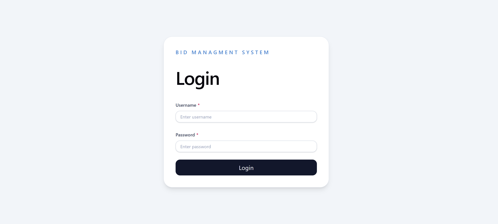
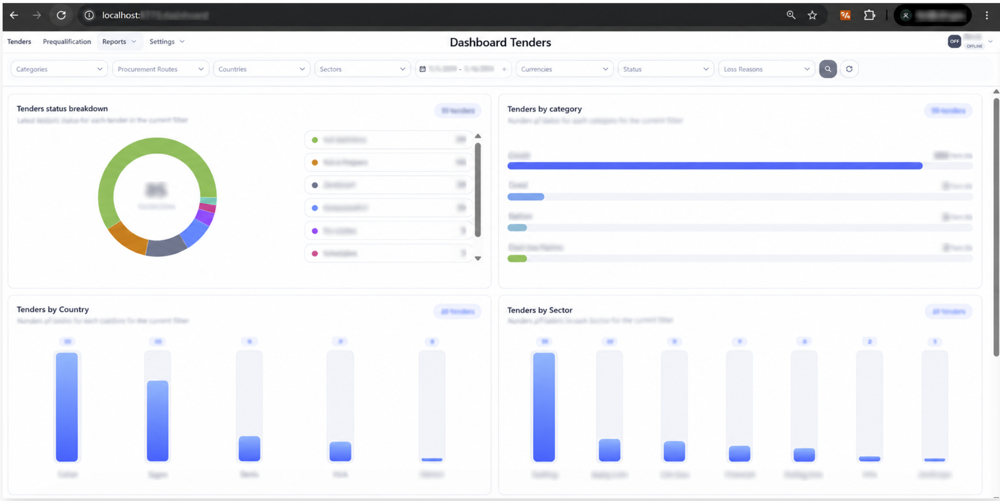
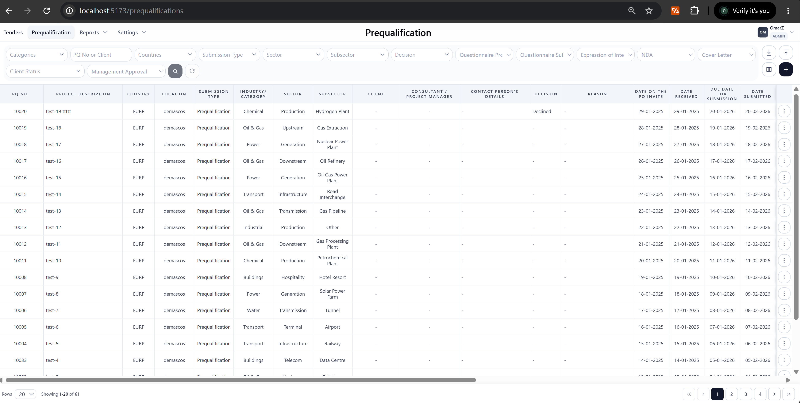
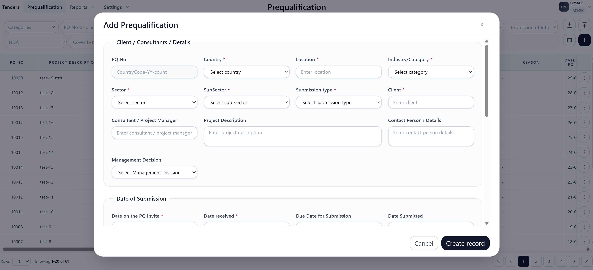
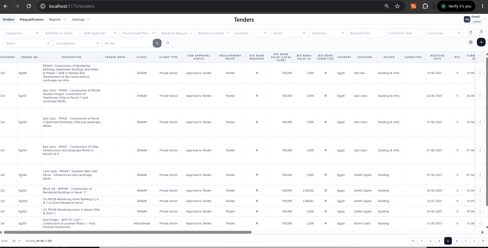
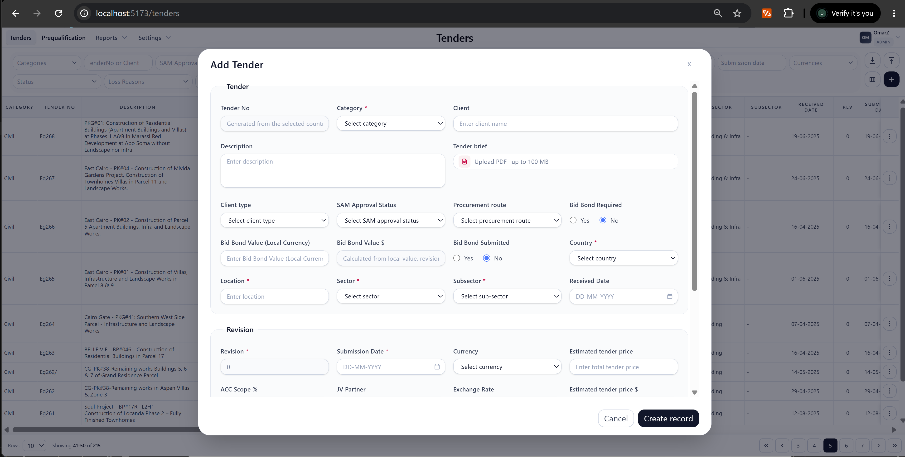

# 🚀 Bid Management System

### Enterprise Bid & Prequalification Management Platform

A modern full-stack enterprise application designed to streamline **prequalification, tender, submission, approval, and document management workflows**.

> **Portfolio Note:** This repository presents the application's features, architecture, and UI. The source code is private because the application was developed for a company environment.

---

## 🖥️ Application Preview

<a href="screenshots/login.png">
  
</a>

**Click the image to view the full-size screenshot.**

---

## ✨ Key Features

<table>
<tr>
<td width="50%">

### 📋 Prequalification Management

* Create and manage prequalifications
* Submission type management
* Category & sector classification
* Management decisions
* Approval-to-tender workflow
* Advanced filtering and sorting

</td>
<td width="50%">

### 📑 Tender Management

* Tender creation and management
* Industry / sector / subsector hierarchy
* Tender workflow management
* Submission tracking
* Status management
* Structured tender information

</td>
</tr>

<tr>
<td width="50%">

### 📁 Document Management

* File upload
* Document validation
* PDF preview
* Complete submission documents
* NDA documents
* Invitation documents

</td>
<td width="50%">

### 🔐 Access Control

* Role-based permissions
* Admin and editor access
* Country-based access
* Controlled editing permissions
* Approval restrictions

</td>
</tr>
</table>

---

# 🏗️ Architecture

The application follows a modern layered architecture:

```text
┌───────────────────────────────────────────────┐
│                 React Frontend                │
│                                               │
│ React • TypeScript • Material UI              │
│ React Hook Form • Zod • TanStack Query        │
└───────────────────────┬───────────────────────┘
                        │
                        │ REST API
                        ▼
┌───────────────────────────────────────────────┐
│              ASP.NET Core Web API             │
│                                               │
│ Controllers • Services • Authorization        │
│ Business Logic • File Management              │
└───────────────────────┬───────────────────────┘
                        │
                        │ Entity Framework Core
                        ▼
┌───────────────────────────────────────────────┐
│                  SQL Server                   │
│                                               │
│ Users • Prequalifications • Tenders           │
│ Categories • Sectors • SubSectors             │
└───────────────────────────────────────────────┘
```

---

# 🛠️ Technology Stack

### Frontend


* React
* TypeScript
* Material UI
* React Hook Form
* Zod
* TanStack Query

### Backend


* ASP.NET Core Web API
* Entity Framework Core
* SQL Server
* REST APIs
* Authentication & Authorization

---

# 📸 Application Screens

## Tender Dashboard

<a href="screenshots/dashboard.png">
  
</a>

---

## Prequalification Management

A centralized interface for managing prequalification records, statuses, decisions, categories, sectors, and submissions.

<a href="screenshots/prequalification-list.png">
  
</a>

---

## Prequalification Form

Structured form for creating and managing prequalification information with validation and controlled fields.

<a href="screenshots/prequalification-form.png">
  
</a>

---

## Tender Management

Manage tenders and organize them through category, sector, and subsector classification.

<a href="screenshots/tender-list.png">
  
</a>

---

## Tender Form

<a href="screenshots/tender-form.png">
  
</a>

---

## Document Management

Upload and manage required project documents with validation and preview functionality.


---

# 🔄 Core Workflow

```text
                 ┌──────────────────┐
                 │  Prequalification │
                 └────────┬─────────┘
                          │
                          ▼
                 ┌──────────────────┐
                 │ Management       │
                 │ Decision         │
                 └────────┬─────────┘
                          │
                    Approved?
                     /       \
                   No         Yes
                   │           │
                   ▼           ▼
                Declined   Approve to
                            Tender
                              │
                              ▼
                     ┌─────────────────┐
                     │     Tender      │
                     └────────┬────────┘
                              │
                              ▼
                     Document Management
                              │
                              ▼
                         Submission
```

---

# 🎯 Development Highlights

### ⚡ Modern React Architecture

Built using reusable components, form validation, server-state management, and structured API services.

### 🔄 API-Driven Application

The frontend communicates with the ASP.NET Core backend through REST APIs, keeping the presentation and business logic separated.

### 🧩 Reusable Components

Reusable form fields, dialogs, tables, file upload components, PDF preview components, and validation patterns improve consistency across the application.

### 🔐 Controlled Access

Application permissions are enforced according to user roles and assigned access, preventing unauthorized modification of sensitive records.

### 📂 Enterprise File Management

The application supports structured document workflows for invitations, NDAs, complete submissions, and other project documents.

---

# 📊 Data Structure

The system organizes project information using a structured hierarchy:

```text
Category
   │
   └── Sector
          │
          └── Subsector
                  │
                  ├── Prequalification
                  │
                  └── Tender
```

This structure allows projects and submissions to be consistently classified and filtered.

---

# 👨‍💻 My Role

**Full Stack Developer**

Responsibilities included:

* Designing and developing frontend features using React
* Developing backend APIs using ASP.NET Core
* Designing database relationships with Entity Framework Core
* Implementing forms and validation
* Implementing role-based access control
* Developing file upload and document workflows
* Implementing PDF preview functionality
* Building filtering, sorting, and search functionality
* Integrating frontend and backend APIs
* Debugging and improving application workflows
* Database migrations and schema updates

---

# 📈 Engineering Focus

The project focuses on:

**Scalability**
Reusable components and structured application layers.

**Maintainability**
Separation between UI, API, business logic, and database access.

**Security**
Role-based permissions and controlled access to project information.

**User Experience**
Consistent forms, validation, filtering, document handling, and responsive interfaces.

---

# 🔒 Source Code

The source code is **not publicly available** because this is a company project.

This repository is intended as a **portfolio presentation**, showcasing:

* Application architecture
* Technology stack
* Features
* UI/UX
* Development responsibilities
* Real-world enterprise workflow

---

# 👨‍💻 Developer

### Omar Zraika

**Full Stack Developer**

React • Next.js • TypeScript • .NET • ASP.NET Core • SQL Server

[](YOUR_LINKEDIN_URL)

---

⭐ **Interested in the project or my experience? Feel free to connect with me on LinkedIn.**
