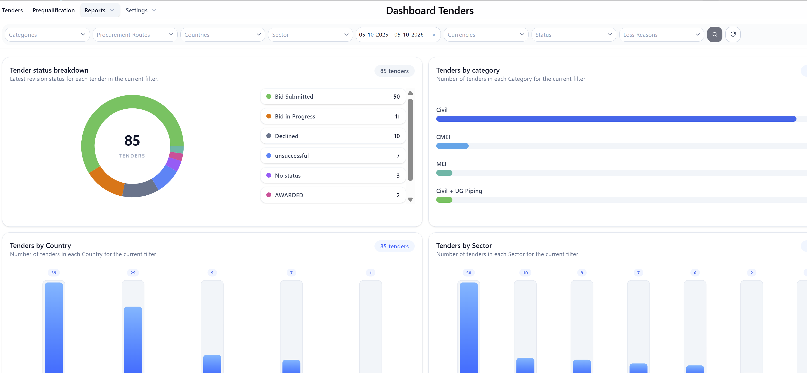

# Bid Management System

## Overview

A full-stack enterprise application for managing prequalifications,
tenders, submissions, approvals, and documents.

## Technologies

- React
- TypeScript
- Material UI
- ASP.NET Core
- Entity Framework Core
- SQL Server

## Architecture

React Frontend
        ↓
ASP.NET Core Web API
        ↓
Entity Framework Core
        ↓
SQL Server

## Screenshots

### Dashboard

### Prequalification Management

### Prequalification Form

### Tender Management

## Key Features

- Prequalification management
- Tender management
- Approval workflow
- Role-based access control
- Document management
- PDF generation and preview
- Search, filtering and sorting

## Note

This project was developed for a company environment.
The source code is private and cannot be publicly shared.
This repository provides a portfolio overview of the
application, architecture, technologies, and key features.
